# Introduction

This repository contains all automation tests (both of UI and API) for ServiceNow product

- Automation Framework: Katalon
- Language: Groovy, Java
- Design Pattern: Fluent Page Object Pattern, POM

## **Prerequisites**

- Java 8+ installed already
- Katalon Studio installed already

## **Framework Introduction**

### **1. UI Automation**

#### **1.1. Structure**

##### **Profile**

- `default`: Config environment/ global variables for running test (default: <https://ven04547.service-now.com>)
- `now-performance`: Config environment which existing a large data to run performance test (default site: <https://ven05364.service-now.com/sp/navpage.do>)

##### **Keyword**

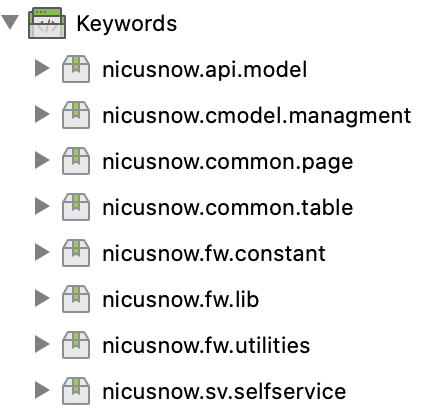

- `nicusnow.fw.*`: ***Using the keywords for building core framework function***
  - `Constants`: All constant of system (Left Navigator component information)
  - `Libs`: Contains all Base Page, Base Service, Page Generator for automation testing product
  - `NElement`: Return TestObject class to use to locate element on Page Object Classes
  - `NPage`: Generate Page Object class to reduce initial new instances to reduce system hang when executing test
  - `BasePage`: Parent page for other page objects classes, contains common functions on many pages
    - Some common functions: switchToIframe(), switchToWindow(), scrollToAndClick(), etc.
  - `NWebDriverEventHandler`: Custom driver event handler listener to view driver event log when local running
  - `TableCommonMethods`: Handle actions on Data Table Grids
  - `Utilities`: Include method to working with file, excel file, csv file

#####

- `nicusnow.*`: ***Implement the Page Object Model (POM Pattern) to make the Test Objects (UI Objects) attached to their pages (Page Objects) to do the Web actions such as clicking a button or filling in a textbox***
  - `nicusnow.cmodel.*`: Page Object Classes, those are organized based on the site maps and each class will be inherited from `BasePage` class
  - `nicusnow.common.page`: Handle pages which are used on almost testcases (Header, Navigator Bar, Table Grid, etc)
  - `nicusnow.common.table`: Define common actions on Table Grids

##### **Object Repository**

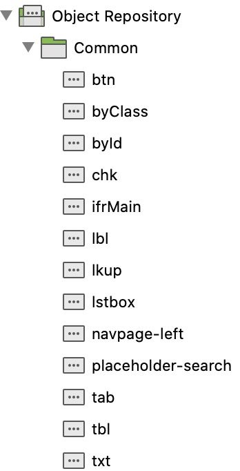

- The Scripter should try to use dynamic element to avoid creating too many test objects. It is also convenient to avoid object duplication during development time
- It is the same as `Test Cases` folder. The UI objects should be contained in the same structure of the pages, frames, popup dialogs.
- Will be inherited from `NElement` class

##### **Test Data**

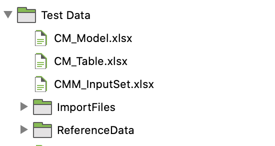

- Define set of test data in Excel file to execute testcase with data-driven
- Each Excel file is each component (CommonTable, Management, etc), each scenario map with each sheet, sheet name is testcaseID
  - `CMM_InputSet`: Contains data test for Cost Modeling Input Set component
  - `COMMON_Tables`: Contains data test for Common Table component
- `ReferenceData data`: Contains data need to be existed on system (***Currently manually create/update data to system before execute script on new environment***)

##### **Data Files**

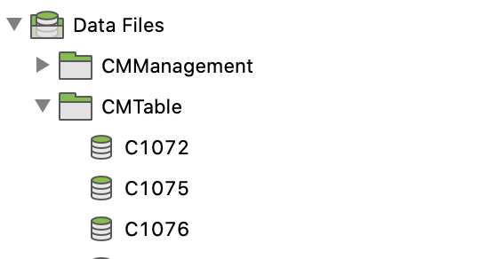

- Seeding data files are organized based on the site maps just like how the test cases are organized
- Conduct data-driven testing with external data sources which defined in `Test Data`
- Naming convention: Name of data is test case ID

##### **Test Case**

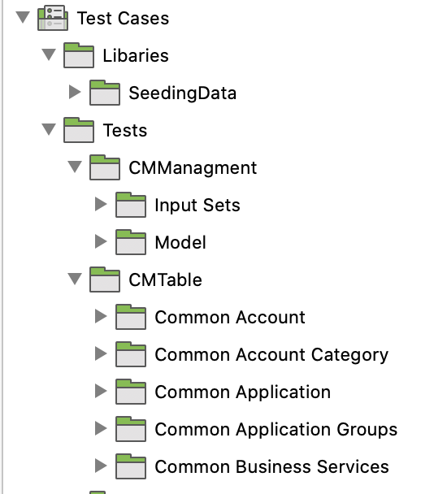

- `Libaries/SeedingData`: Contains scripts to update/refresh test data which defined on `Data Files`
- `Tests`: Test scripts are organized based on the site maps. For examples, test cases for Input Sets feature should be stored under Cost Modeling Management >Planning>Input Sets folder.

##### **Test Suites**

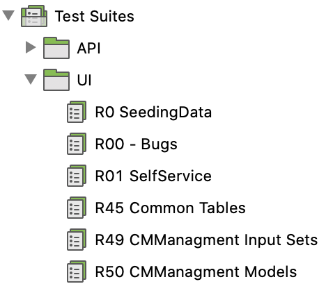

- It should not be large, and the naming the same with the Test Run on the TestRail for Integration Purpose

#### **1.2 Develop Testscript**

Here are some note for implement test scripts:

  1. Review manual test case on TestRail, check if we can reuse existing script or not, then map 1-1 checkpoint with test case on TestRail
  2. Define test script on Test Suite
  3. Define data test and make sure data is loaded on `Data Files`, Skip this step If test case does not need to use data-driven test
  4. Define variables (must match with colum which defined on data test file), the naming format is lowercase and separate by underscore (ex: application_group, account_name, etc)
  5. Define default value for variable incase run at testcase level without data-driven test
  6. Implement script:

- Define log step clearly to make readable on report
- Be smart to take screenshot, only take screenshot at necessary and valuable steps, do not take screenshot at the duplicate step

  7. Execute test case
  8. Commit code and make PR ( Note evidence: 3 times running Passed)
  9. After code is merged into develop, need to change `Automated` status on TestRail
  10. Check if test script run failed, pls move this test script into `Test Suites/ROO - Bugs` for easy monitoring

#### **1.3  Execute test**

- Edit configuration on `default` profile, choose `isAPIRunning` is `false`
- Execute test
  - At Test Case level: Execute test with Chrome option
  - At Test Suite level
    - `R0 Seeding data`: Only run when need to sync latest data with `ReferenceData data`
- In our framework currently, data-driven only apply when running at test suite level
- Move failed test scripts into `Test Suites/ROO - Bugs` for easy monitoring

### **2. API Automation**

#### **2.1. Structure**

##### **Keyword**

- `BaseService`: Parent page and to be inhered from endpoint object model, contains common functions for API endpoint testing (set baseUrl, set Auth, setPayload, setMethod, ect.)
- `nicusnow.api.model`: contains all api service object class

##### **Test Case**

- All API test scenarios are implemented under folder `Tests/RestAPIs`

#### **2.2 Develop testscript**

- Test case should be implemented under `Tests/RestAPIs`

- Design test follow fluent pattern, **remember to `.initRequestObject()` to initialize request instance**

#### **2.3  Execute test**

- Edit environment configuration profile

    ```
    encodedToken
    baseUrl
    isAPIRuning: true
    ```

- Execute at Test Case or Test Suite level with `Web Service` option

## Report

Integrate with Katalon TestOps to manage all requirement test and defects in one place
> TBD

## Note

## Agent Setup & Schedule Test

#### **Server Info**

- Linux: `192.168.59.154` - Account: `nicus / Kms@2022!@`
- ssh command: `ssh nicus@192.168.59.154` => enter password

#### **Set up Agent**

- Access to Katalon Test Ops => Nicus Project: <https://testops.katalon.io/team/138690/project/153118>

- Setup Script Repositories:

[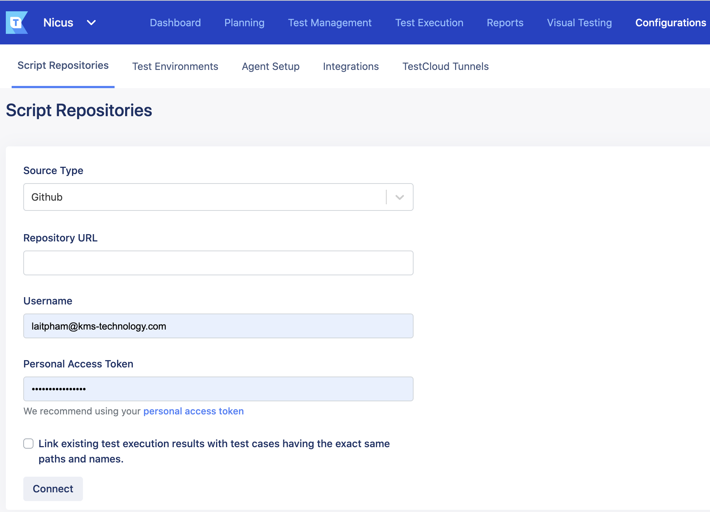](Images/ReadMeImages/script_repo.png)

- Following this doc to set up a local agent : <https://docs.katalon.com/docs/katalon-testops/remote-execution/local-test-environments/create-a-local-test-environment-with-an-agent>

#### **Schedule test run**

1. SSH to linux server: `ssh nicus@192.168.59.154` => Enter server password
2. Go to `katalon-agent-linux-x64-v1.7.4` folder : `cd Documents/Nicus/katalon-agent-linux-x64-v1.7.4`
3. Start agent: `./cli-linux-x64 start-agent`
4. Go to Test Environment tab on TestOps to make sure agent is online

[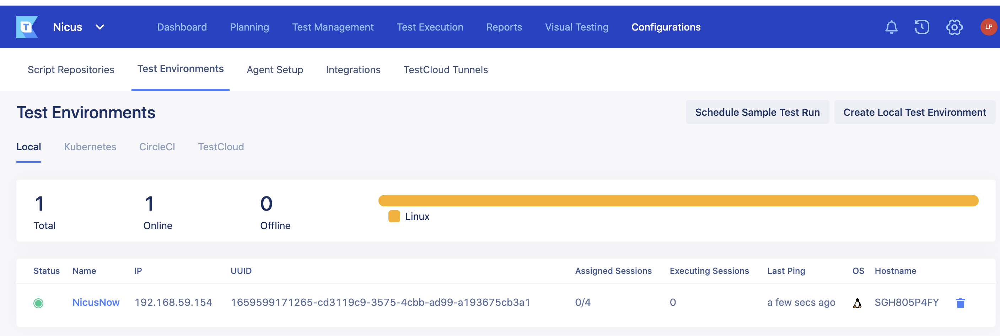](Images/ReadMeImages/test_env.png)

- Schedule Test Run: <https://docs.katalon.com/docs/katalon-testops/test-planning/schedules/schedule-test-runs>

[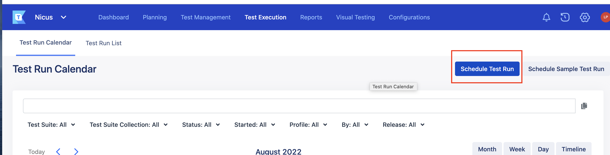](Images/ReadMeImages/schedule_test_run.png)

- Input all information => Execute test on the `Headless` mode

[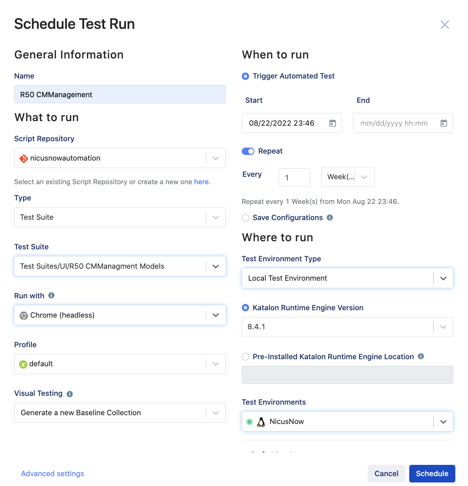](Images/ReadMeImages/schedule.png)

[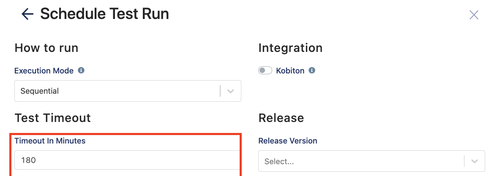](Images/ReadMeImages/time_out.png)

- Check schedule test run status

[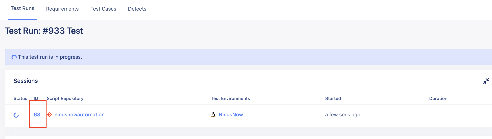](Images/ReadMeImages/test_run.png)

[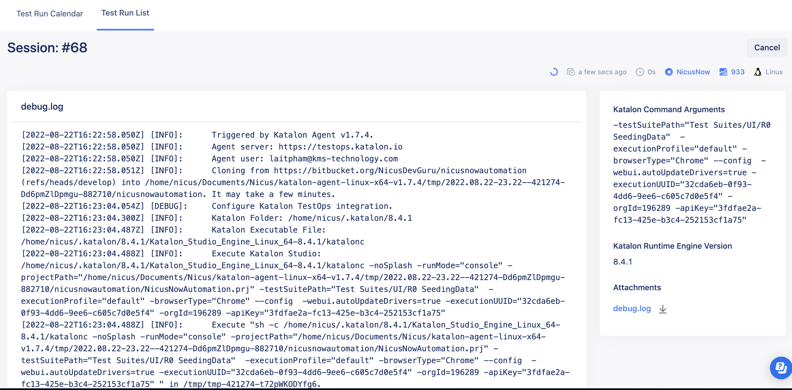](Images/ReadMeImages/test_log.png)

#### **Tips and tricks**

- Set time out for running test base on your total test run time
- Server is online but do not have any trigger actions => Delete agent and run setup agent again

    ```
    At `katalon-agent-linux-x64-v1.7.4` folder on server, run command:

    ./cli-linux-x64 config --server-url https://testops.katalon.io --username `<input your testops username/email>` --apikey `<input testops api key>` --teamid 138690 --agent-name "My Agent"

    Then start agent: ./cli-linux-x64 start-agent
    ```

- `Error: License Quota exceeded... to active KRE` => Remove online machine here

[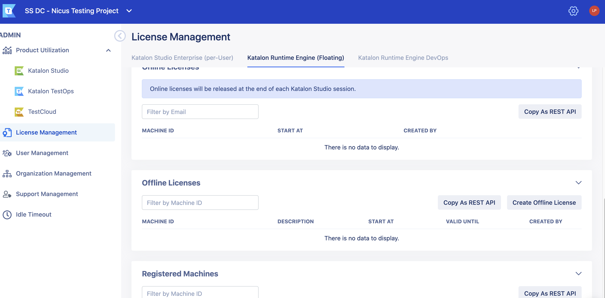](Images/ReadMeImages/license.png)
